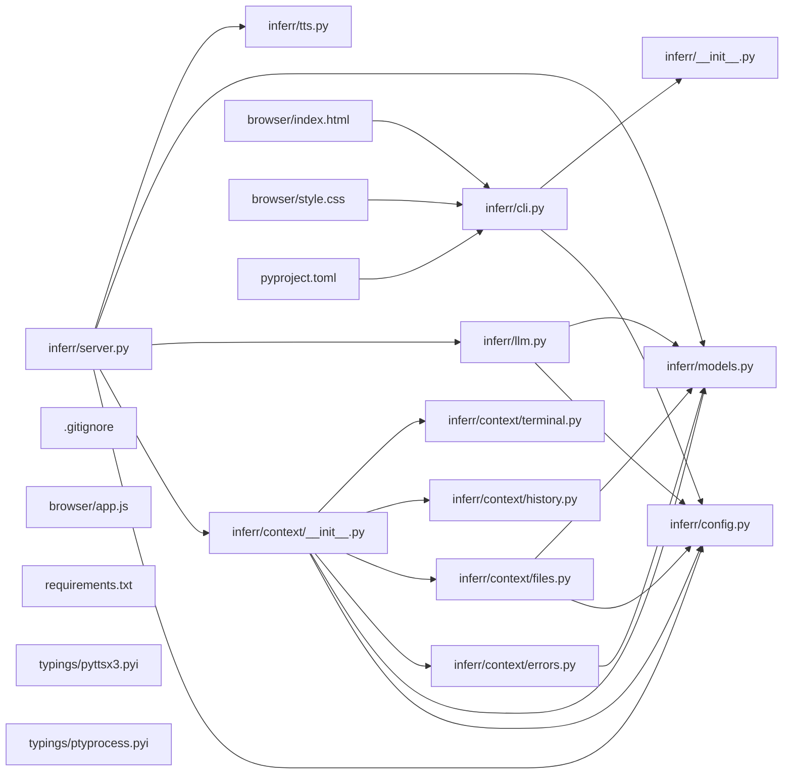

## ARCHITECTURE

A software project composed of the following subsystems:

- **inferr/**: Primary subsystem containing 12 files
- **browser/**: Primary subsystem containing 3 files
- **tests/**: Primary subsystem containing 3 files
- **typings/**: Primary subsystem containing 2 files
- **Root**: Contains scripts and execution points

## ENTRY_POINTS

### `inferr/cli.py`

```python
from __future__ import annotations

from dataclasses import replace
import os
import threading
import time
from typing import Optional

import click
import httpx
import uvicorn

from inferr.config import Config, load_config
from inferr import server as server_module


@click.group()
def cli() -> None:
    """Inferr command line interface."""


def _resolve_port(config: Config, port_override: Optional[int]) -> int:
    if port_override is not None:
        return port_override
    env_port = os.environ.get("INFERR_PORT")
    if env_port:
        try:
            return int(env_port)
        except ValueError:
            return config.port
    return config.port


def _resolve_host(config: Config, host_override: Optional[str]) -> str:
    if host_override is not None:
        return host_override
    return config.host


def _start_session_when_ready(base_url: str) -> None:
    deadline = time.monotonic() + 10.0
    while time.monotonic() < deadline:
        try:
            with httpx.Client(timeout=1.0) as client:
                response = client.get(f"{base_url}/health")
                if response.status_code == 200:
                    break
        except httpx.ConnectError:
            time.sleep(0.2)
        except httpx.HTTPError:
            time.sleep(0.2)
    else:
        return

    try:
        with httpx.Client(timeout=5.0) as client:
            client.post(f"{base_url}/session/start")
    except httpx.HTTPError:
        return


@cli.command()
@click.option("--host", type=str, default=None)
@click.option("--port", type=int, default=None)
@click.option("--no-browser", is_flag=True, default=False)
@click.option("--lang", type=str, default=None)
def start(
    host: Optional[str], port: Optional[int], no_browser: bool, lang: Optional[str]
) -> None:
    """Start the Inferr server and initialize a session."""
    config = load_config()
    resolved_port = _resolve_port(config, port)
    resolved_host = _resolve_host(config, host)
    resolved_lang = lang if lang is not None else config.language

    config = replace(
        config, host=resolved_host, port=resolved_port, language=resolved_lang
    )

    server_module.CONFIG_OVERRIDE = config
    os.environ["INFERR_PORT"] = str(resolved_port)
    if no_browser:
        os.environ["INFERR_NO_BROWSER"] = "1"

    base_url = f"http://{resolved_host}:{resolved_port}"
    thread = threading.Thread(
        target=_start_session_when_ready, args=(base_url,), daemon=True
    )
    thread.start()

    uvicorn.run(
        "inferr.server:app", host=resolved_host, port=resolved_port, log_level="info"
    )


@cli.command()
def stop() -> None:
    """Stop the current Inferr session."""
    config = load_config()
    port_value = _resolve_port(config, None)
    base_url = f"http://{config.host}:{port_value}"

    try:
        with httpx.Client(timeout=5.0) as client:
            client.post(f"{base_url}/session/stop")
        click.echo("Inferr session stopped.")
    except httpx.ConnectError:
        click.echo("Inferr is not running. Start it with `inferr start`.")
    except httpx.HTTPError:
        click.echo("Failed to stop session.")


@cli.command()
def status() -> None:
    """Show the current Inferr status."""
    config = load_config()
    port_value = _resolve_port(config, None)
    base_url = f"http://{config.host}:{port_value}"

    try:
        with httpx.Client(timeout=5.0) as client:
            response = client.get(f"{base_url}/health")
        data = response.json()
        click.echo(f"Session active: {data.get('session_active')}")
        click.echo(f"Last activity: {data.get('last_activity')}")
    except httpx.ConnectError:
        click.echo("Inferr is not running. Start it with `inferr start`.")
    except httpx.HTTPError:
        click.echo("Failed to fetch status.")


@cli.command()
@click.option("--n", type=int, default=None)
def logs(n: Optional[int]) -> None:
    """Show recent terminal buffer lines and conversation history."""
    config = load_config()
    port_value = _resolve_port(config, None)
    base_url = f"http://{config.host}:{port_value}"
    limit = n if n is not None else config.terminal_buffer_lines

    try:
        with httpx.Client(timeout=5.0) as client:
            response = client.get(f"{base_url}/context")
        if response.status_code == 404:
            click.echo("No active session.")
            return
        data = response.json()
        terminal_lines = data.get("terminal_buffer", [])[-limit:]
        history = data.get("conversation_history", [])

        click.echo("--- Terminal Buffer ---")
        for line in terminal_lines:
            click.echo(line)

        click.echo("--- Conversation History ---")
        for turn in history:
            role = turn.get("role", "")
            content = turn.get("content", "")
            click.echo(f"{role}: {content}")
    except httpx.ConnectError:
        click.echo("Inferr is not running. Start it with `inferr start`.")
    except httpx.HTTPError:
        click.echo("Failed to fetch logs.")

```

## SYMBOL_INDEX

**`inferr/config.py`**
- class `Config`
- `_default_toml()`
- `_get_table()`
- `_coerce_int()`
- `_coerce_str()`
- `_coerce_str_list()`
- `_ensure_config_file()`
- `load_config()`

**`inferr/models.py`**
- class `ActiveFile`
- class `FlaggedError`
- class `ConversationTurn`
- class `ContextObject`
- class `QueryRequest`
- class `QueryResponse`
- class `WebSocketMessage`

**`inferr/cli.py`**
- `cli()`
- `_resolve_port()`
- `_resolve_host()`
- `_start_session_when_ready()`
- `start()`
- `stop()`
- `status()`
- `logs()`

**`inferr/context/__init__.py`**
- class `ContextAssembler`
  - `__init__()`
  - `start()`
  - `stop()`
  - `assemble()`

**`inferr/llm.py`**
- `build_system_prompt()`
- `query_llm()`

**`inferr/context/errors.py`**
- `_first_meaningful()`
- `_last_meaningful()`
- `_should_emit()`
- `_make_error()`
- `extract_errors()`

**`inferr/context/history.py`**
- `_strip_zsh_prefix()`
- `read_shell_history()`

**`inferr/context/files.py`**
- `_normalize_event_path()`
- class `_FileEventHandler`
  - `__init__()`
  - `on_modified()`
  - `on_created()`
- class `FileWatcher`
  - `__init__()`
  - `process_path()`
  - `get_active_file()`
  - `start()`
  - `stop()`

**`inferr/server.py`**
- `_apply_env_overrides()`
- `get_config()`
- `lifespan()`
- `unhandled_exception_handler()`
- `start_session()`
- `stop_session()`
- `get_context()`
- `health()`
- `websocket_endpoint()`
- `query_endpoint()`

## IMPORTANT_CALL_PATHS

cli.cli()
  → config.Config()
## CORE_MODULES

### `inferr/config.py`

**Purpose:** Implements config.

**Types:**
- `Config`

**Functions:**
- `def _coerce_int(value: object, default: int) -> int`
- `def _coerce_str(value: object, default: str) -> str`
- `def _coerce_str_list(value: object, default: list[str]) -> list[str]`
- `def _default_toml() -> str`
- `def _ensure_config_file(path: Path) -> None`
- `def _get_table(data: Mapping[str, object]) -> dict[str, object]`
- `def load_config() -> Config`

### `inferr/models.py`

**Purpose:** Implements models.

**Types:**
- `ActiveFile` (bases: `BaseModel`)
- `ContextObject` (bases: `BaseModel`)
- `ConversationTurn` (bases: `BaseModel`)
- `FlaggedError` (bases: `BaseModel`)
- `QueryRequest` (bases: `BaseModel`)
- `QueryResponse` (bases: `BaseModel`)

## SUPPORTING_MODULES

### `inferr/__init__.py`

*6 lines, 0 imports*

### `inferr/context/__init__.py`

```python
class ContextAssembler

```

### `inferr/llm.py`

```python
def build_system_prompt(language: str) -> str

def query_llm(request: QueryRequest, config: Config) -> str

```

### `inferr/context/errors.py`

```python
def _first_meaningful(lines: Iterable[str]) -> str

def _last_meaningful(lines: list[str]) -> str

def _should_emit(error_type: str, summary: str) -> bool

def _make_error(
    error_type: str, summary: str, raw_lines: list[str]
) -> FlaggedError | None

def extract_errors(lines: list[str]) -> list[FlaggedError]

```

### `inferr/context/history.py`

```python
def _strip_zsh_prefix(line: str) -> str

def read_shell_history(depth: int) -> list[str]

```

### `inferr/context/files.py`

```python
def _normalize_event_path(value: str | bytes) -> Path | None

class _FileEventHandler(FileSystemEventHandler)

class FileWatcher

```

### `inferr/server.py`

```python
def _apply_env_overrides(config: Config) -> Config

def get_config() -> Config

def lifespan(app: FastAPI)
    """FastAPI lifespan manager."""

def unhandled_exception_handler(request: Request, exc: Exception) -> JSONResponse
    """Return structured JSON for unexpected server errors."""

def start_session() -> dict[str, str]
    """Initialize a new Inferr session and context capture."""

def stop_session() -> dict[str, str]
    """Stop the current Inferr session."""

def get_context() -> JSONResponse
    """Return the current context object."""

def health() -> dict[str, object | None]
    """Return server health status."""

def websocket_endpoint(websocket: WebSocket) -> None
    """Handle WebSocket transcript streaming and LLM responses."""

def query_endpoint(request: QueryRequest) -> QueryResponse
    """HTTP fallback endpoint for transcript queries."""

```

## DEPENDENCY_GRAPH



## RANKED_FILES

| File | Score | Tier | Tokens |
|------|-------|------|--------|
| `inferr/config.py` | 0.850 | structured summary | 138 |
| `inferr/models.py` | 0.775 | structured summary | 90 |
| `inferr/cli.py` | 0.700 | full source | 1167 |
| `inferr/__init__.py` | 0.550 | signatures | 17 |
| `inferr/context/__init__.py` | 0.533 | signatures | 19 |
| `inferr/llm.py` | 0.533 | signatures | 41 |
| `inferr/context/errors.py` | 0.525 | signatures | 101 |
| `inferr/context/history.py` | 0.525 | signatures | 38 |
| `inferr/context/files.py` | 0.483 | signatures | 41 |
| `inferr/server.py` | 0.483 | signatures | 191 |
| `inferr/context/terminal.py` | 0.475 | one-liner | 22 |
| `inferr/tts.py` | 0.475 | one-liner | 21 |
| `README.md` | 0.450 | one-liner | 10 |
| `browser/index.html` | 0.450 | one-liner | 11 |
| `browser/style.css` | 0.450 | one-liner | 11 |
| `pyproject.toml` | 0.450 | one-liner | 12 |
| `tests/test_context.py` | 0.433 | one-liner | 20 |
| `tests/test_llm.py` | 0.433 | one-liner | 21 |
| `tests/test_server.py` | 0.433 | one-liner | 20 |
| `.gitignore` | 0.400 | one-liner | 10 |
| `browser/app.js` | 0.400 | one-liner | 15 |
| `requirements.txt` | 0.400 | one-liner | 10 |
| `typings/pyttsx3.pyi` | 0.100 | one-liner | 23 |
| `typings/ptyprocess.pyi` | 0.098 | one-liner | 22 |

## PERIPHERY

- `inferr/context/terminal.py` — 1 class, 5 imports, 66 lines
- `inferr/tts.py` — 2 functions, 1 imports, 21 lines
- `README.md` — 61 lines
- `browser/index.html` — 48 lines
- `browser/style.css` — 201 lines
- `pyproject.toml` — 51 lines
- `tests/test_context.py` — 6 functions, 9 imports, 140 lines
- `tests/test_llm.py` — 3 functions, 5 imports, 78 lines
- `tests/test_server.py` — 4 functions, 5 imports, 69 lines
- `.gitignore` — 29 lines
- `browser/app.js` — 5 functions, 153 lines
- `requirements.txt` — 68 lines
- `typings/pyttsx3.pyi` — 1 class, 1 function, 11 lines
- `typings/ptyprocess.pyi` — 1 class, 1 imports, 22 lines

