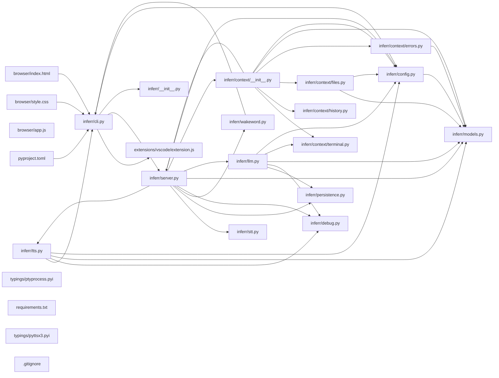

## ARCHITECTURE

A software project composed of the following subsystems:

- **inferr/**: Primary subsystem containing 18 files
- **tests/**: Primary subsystem containing 12 files
- **browser/**: Primary subsystem containing 3 files
- **extensions/**: Primary subsystem containing 3 files
- **Root**: Contains scripts and execution points

## ENTRY_POINTS

### `inferr/cli.py`

```python
from __future__ import annotations

from dataclasses import replace
import os
from pathlib import Path
import threading
import time
from typing import Optional

import click
import httpx
import uvicorn

from inferr.config import Config, load_config
from inferr import server as server_module


@click.group()
def cli() -> None:
    """Inferr command line interface."""


def _resolve_port(config: Config, port_override: Optional[int]) -> int:
    if port_override is not None:
        return port_override
    env_port = os.environ.get("INFERR_PORT")
    if env_port:
        try:
            return int(env_port)
        except ValueError:
            return config.port
    return config.port


def _resolve_host(config: Config, host_override: Optional[str]) -> str:
    if host_override is not None:
        return host_override
    return config.host


def _start_session_when_ready(base_url: str) -> None:
    deadline = time.monotonic() + 10.0
    while time.monotonic() < deadline:
        try:
            with httpx.Client(timeout=1.0) as client:
                response = client.get(f"{base_url}/health")
                if response.status_code == 200:
                    break
        except httpx.ConnectError:
            time.sleep(0.2)
        except httpx.HTTPError:
            time.sleep(0.2)
    else:
        return

    try:
        with httpx.Client(timeout=5.0) as client:
            client.post(f"{base_url}/session/start")
    except httpx.HTTPError:
        return


@cli.command()
@click.option("--host", type=str, default=None)
@click.option("--port", type=int, default=None)
@click.option("--no-browser", is_flag=True, default=False)
@click.option("--lang", type=str, default=None)
def start(
    host: Optional[str], port: Optional[int], no_browser: bool, lang: Optional[str]
) -> None:
    """Start the Inferr server and initialize a session."""
    config = load_config()
    if not config.gemini.api_key:
        click.echo(
            "[inferr] ERROR: GEMINI_API_KEY is not set. "
            "Add it to your .env file or export it as an environment variable.",
            err=True,
        )
        raise SystemExit(1)
    resolved_port = _resolve_port(config, port)
    resolved_host = _resolve_host(config, host)
    resolved_lang = lang if lang is not None else config.language

    config = replace(
        config, host=resolved_host, port=resolved_port, language=resolved_lang
    )

    server_module.CONFIG_OVERRIDE = config
    os.environ["INFERR_PORT"] = str(resolved_port)
    if no_browser:
        os.environ["INFERR_NO_BROWSER"] = "1"

    base_url = f"http://{resolved_host}:{resolved_port}"
    thread = threading.Thread(
        target=_start_session_when_ready, args=(base_url,), daemon=True
    )
    thread.start()

    uvicorn.run(
        "inferr.server:app", host=resolved_host, port=resolved_port, log_level="info"
    )


@cli.command()
def stop() -> None:
    """Stop the current Inferr session."""
    config = load_config()
    port_value = _resolve_port(config, None)
    base_url = f"http://{config.host}:{port_value}"

    try:
        with httpx.Client(timeout=5.0) as client:
            client.post(f"{base_url}/session/stop")
        click.echo("Inferr session stopped.")
    except httpx.ConnectError:
        click.echo("Inferr is not running. Start it with `inferr start`.")
    except httpx.HTTPError:
        click.echo("Failed to stop session.")


@cli.command()
def status() -> None:
    """Show the current Inferr status."""
    config = load_config()
    port_value = _resolve_port(config, None)
    base_url = f"http://{config.host}:{port_value}"

    try:
        with httpx.Client(timeout=5.0) as client:
            response = client.get(f"{base_url}/health")
        data = response.json()
        click.echo(f"Session active: {data.get('session_active')}")
        click.echo(f"Last activity: {data.get('last_activity')}")
    except httpx.ConnectError:
        click.echo("Inferr is not running. Start it with `inferr start`.")
    except httpx.HTTPError:
        click.echo("Failed to fetch status.")


@cli.command()
@click.option("--n", type=int, default=None)
def logs(n: Optional[int]) -> None:
    """Show recent terminal buffer lines and conversation history."""
    config = load_config()
    port_value = _resolve_port(config, None)
    base_url = f"http://{config.host}:{port_value}"
    limit = n if n is not None else config.terminal_buffer_lines

    try:
        with httpx.Client(timeout=5.0) as client:
            response = client.get(f"{base_url}/context")
        if response.status_code == 404:
            click.echo("No active session.")
            return
        data = response.json()
        terminal_lines = data.get("terminal_buffer", [])[-limit:]
        history = data.get("conversation_history", [])

        click.echo("--- Terminal Buffer ---")
        for line in terminal_lines:
            click.echo(line)

        click.echo("--- Conversation History ---")
        for turn in history:
            role = turn.get("role", "")
            content = turn.get("content", "")
            click.echo(f"{role}: {content}")
    except httpx.ConnectError:
        click.echo("Inferr is not running. Start it with `inferr start`.")
    except httpx.HTTPError:
        click.echo("Failed to fetch logs.")


@cli.command("install-shell")
@click.option("--shell", "shell_name", type=click.Choice(["zsh", "bash"]), default=None)
def install_shell(shell_name: Optional[str]) -> None:
    """Install the Inferr shell integration plugin."""
    import shutil

    detected = os.environ.get("SHELL", "")
    if shell_name is None:
        if "zsh" in detected:
            shell_name = "zsh"
        elif "bash" in detected:
            shell_name = "bash"
        else:
            click.echo("Could not detect shell. Use --shell zsh or --shell bash.")
            raise SystemExit(1)

    plugin_src = Path(__file__).resolve().parent / "shell" / f"inferr.{shell_name}"
    if not plugin_src.exists():
        click.echo(f"Plugin file not found: {plugin_src}")
        raise SystemExit(1)

    inferr_dir = Path.home() / ".inferr"
    inferr_dir.mkdir(parents=True, exist_ok=True)
    dest = inferr_dir / f"inferr.{shell_name}"
    shutil.copy(plugin_src, dest)

    rc_file = Path.home() / (f".{shell_name}rc")
    source_line = f'\nsource "{dest}"  # inferr shell integration\n'

    if rc_file.exists():
        content = rc_file.read_text(encoding="utf-8")
        if str(dest) in content:
            click.echo(f"Already installed in {rc_file}.")
            return
        rc_file.write_text(content + source_line, encoding="utf-8")
    else:
        rc_file.write_text(source_line, encoding="utf-8")

    click.echo(f"Installed inferr shell plugin to {rc_file}.")
    click.echo(f"Run: source {rc_file}")

```

## SYMBOL_INDEX

**`inferr/models.py`**
- class `ActiveFile`
- class `FlaggedError`
- class `ConversationTurn`
- class `ContextObject`
- class `SilkConfig`
- class `GeminiConfig`
- class `DeepgramConfig`
- class `OllamaConfig`
- class `WakeWordConfig`
- class `QueryRequest`
- class `QueryResponse`
- class `WebSocketMessage`
- class `ShellCommandCapture`

**`inferr/config.py`**
- class `Config`
- `_default_toml()`
- `_get_table()`
- `_coerce_int()`
- `_coerce_str()`
- `_coerce_str_list()`
- `_coerce_bool()`
- `_ensure_config_file()`
- `load_config()`

**`inferr/tts.py`**
- `tts_timeout_seconds()`
- class `_PreparedTTSText`
  - `__new__()`
  - `__eq__()`
  - `__len__()`
  - `startswith()`
- class `SilkAPIError`
- class `TTSBackend`
- `_validate_tone()`
- `_count_to_spoken()`
- `_is_bullet()`
- `_strip_bullet_prefix()`
- `_is_hinglish_text()`
- `_preprocess_tts_text()`
- class `SilkTTSBackend`
  - `__init__()`
  - `set_ws_connection()`
  - `speak()`
  - `_preprocess_text()`
  - `_send_to_silk_api()`
  - `is_available()`
  - `name()`
- class `Pyttsx3TTSBackend`
  - `speak()`
  - `_speak_sync()`
  - `is_available()`
  - `name()`
- class `BrowserTTSBackend`
  - `speak()`
  - `is_available()`
  - `name()`
- `get_tts_backend()`
- `speak_pyttsx3()`
- `tts_stub_available()`

**`inferr/llm.py`**
- `_is_high_signal()`
- `_rank_terminal_lines()`
- `build_system_prompt()`
- `_sanitize_context_line()`
- `_shorten_line()`
- `_summarize_context()`
- `_adaptive_token_limit()`
- `_query_ollama()`
- `query_llm()`
- `_try_ollama_fallback()`

**`inferr/cli.py`**
- `cli()`
- `_resolve_port()`
- `_resolve_host()`
- `_start_session_when_ready()`
- `start()`
- `stop()`
- `status()`
- `logs()`
- `install_shell()`

**`inferr/server.py`**
- `get_shell_command_buffer()`
- `_apply_env_overrides()`
- `get_config()`
- `lifespan()`
- `favicon()`
- `unhandled_exception_handler()`
- `start_session()`
- `stop_session()`
- `get_context()`
- `health()`
- `browser_config()`
- `resolve_tone()`
- `_on_wake_word_detected()`
- `_broadcast_wake_word()`
- `speech_to_text_endpoint()`
- `_handle_local_stt()`
- `_handle_deepgram_stt()`
- `websocket_endpoint()`
- class `ShellOutputCapture`
- `capture_command()`
- `capture_output()`
- class `ActiveFilePayload`
- `push_active_file()`
- `get_active_file_context()`
- `query_endpoint()`

**`inferr/context/terminal.py`**
- `sanitize_terminal_line()`
- class `TerminalCapture`
  - `__init__()`
  - `_reader()`
  - `_append_line()`
  - `get_buffer()`
  - `inject_line()`
  - `write()`
  - `stop()`

**`inferr/context/__init__.py`**
- class `ContextAssembler`
  - `__init__()`
  - `start()`
  - `stop()`
  - `inject_command()`
  - `hint_active_file_from_command()`
  - `push_active_file()`
  - `assemble()`

**`inferr/context/files.py`**
- `_normalize_event_path()`
- class `_FileEventHandler`
  - `__init__()`
  - `on_modified()`
  - `on_created()`
- class `FileWatcher`
  - `__init__()`
  - `_resolve_path()`
  - `hint_from_shell_command()`
  - `_iter_source_files()`
  - `seed_recent_files()`
  - `process_path()`
  - `get_active_file()`
  - `push_active_file()`
  - `start()`
  - `stop()`

**`inferr/context/errors.py`**
- `_first_meaningful()`
- `_last_meaningful()`
- `_should_emit()`
- `_make_error()`
- `extract_errors()`

**`browser/app.js`**
- `drawOscilloscope()`
- `escapeHtml()`
- `addExchange()`
- `setSpeaking()`
- `setWsStatus()`
- `setTtsBackend()`
- `setContextStats()`
- `triggerErrorBadge()`
- `loadBrowserConfig()`
- `speakInBrowser()`
- `showReconnectFailure()`
- `scheduleReconnect()`
- `handleTextMessage()`
- `connectWebSocket()`
- `sendTranscript()`
- `float32ToPcm16()`
- `downsampleToSttRate()`
- `handleDeepgramMessage()`
- `startMic()`
- `stopMic()`

**`extensions/vscode/extension.js`**
- `post()`
- `mapLanguage()`
- `pushActiveBuffer()`
- `activate()`
- `deactivate()`

## IMPORTANT_CALL_PATHS

cli.cli()
  → extension.post()
## CORE_MODULES

### `inferr/models.py`

**Purpose:** Implements models.

**Types:**
- `ActiveFile` (bases: `BaseModel`)
- `ContextObject` (bases: `BaseModel`)
- `ConversationTurn` (bases: `BaseModel`)
- `DeepgramConfig` (bases: `BaseModel`)
- `FlaggedError` (bases: `BaseModel`)
- `GeminiConfig` (bases: `BaseModel`)

### `inferr/config.py`

**Purpose:** Implements config.
**Depends on:** `models`

**Types:**
- `Config`

**Functions:**
- `def _coerce_bool(value: object, default: bool) -> bool`
- `def _coerce_int(value: object, default: int) -> int`
- `def _coerce_str(value: object, default: str) -> str`
- `def _coerce_str_list(value: object, default: list[str]) -> list[str]`
- `def _default_toml() -> str`
- `def _ensure_config_file(path: Path) -> None`
- `def _get_table(data: Mapping[str, object]) -> dict[str, object]`
- `def load_config() -> Config`

**Notes:** large file (304 lines)

### `inferr/tts.py`

**Purpose:** Implements tts.
**Depends on:** `config`, `debug`, `models`

**Types:**
- `BrowserTTSBackend` (bases: `TTSBackend`) methods: `is_available`, `name`, `speak`
- `Pyttsx3TTSBackend` (bases: `TTSBackend`) methods: `is_available`, `name`, `speak`

**Functions:**
- `def _count_to_spoken(count: int, hinglish: bool) -> str`
- `def _is_bullet(line: str) -> bool`
- `def _is_hinglish_text(text: str) -> bool`
- `def _preprocess_tts_text(text: str, tone: str = "neutral") -> str`
- `def _strip_bullet_prefix(line: str) -> str`
- `def _validate_tone(tone: str) -> None`

### `inferr/llm.py`

**Purpose:** Implements llm.
**Depends on:** `config`, `context.terminal`, `debug`, `models`, `persistence`

**Functions:**
- `def _adaptive_token_limit(request: QueryRequest, tone: str) -> int`
- `def _is_high_signal(line: str) -> bool`
- `def _query_ollama(system_prompt: str, user_content: str, config_ollama: "OllamaConfig", max_tokens: int) -> str`
- `def _rank_terminal_lines(lines: list[str], limit: int) -> list[str]`
- `def _sanitize_context_line(value: str) -> str`
- `def _shorten_line(value: str, max_len: int = 120) -> str`

### `inferr/server.py`

**Purpose:** Implements server.
**Depends on:** `config`, `context`, `debug`, `llm`, `models`, +4 more

**Types:**
- `ActiveFilePayload` (bases: `BaseModel`)
- `ShellOutputCapture` (bases: `BaseModel`)

**Functions:**
- `def _apply_env_overrides(config: Config) -> Config`
- `def _broadcast_wake_word(phrase: str, score: float) -> None`
- `def _handle_deepgram_stt(websocket: WebSocket, client_host: str) -> None`
- `def _handle_local_stt(websocket: WebSocket, client_host: str) -> None`
- `def _on_wake_word_detected(phrase: str, score: float) -> None`
- `def browser_config() -> dict[str, object]`

## Constants
CONFIG_OVERRIDE: Config | None = None

## SUPPORTING_MODULES

### `inferr/context/terminal.py`

```python
def sanitize_terminal_line(line: str) -> str
    """Strip carriage returns and ANSI escapes so context text stays readable."""

class TerminalCapture

```

### `inferr/context/__init__.py`

```python
class ContextAssembler

```

### `inferr/context/files.py`

```python
def _normalize_event_path(value: str | bytes) -> Path | None

class _FileEventHandler(FileSystemEventHandler)

class FileWatcher

```

### `inferr/context/errors.py`

```python
def _first_meaningful(lines: Iterable[str]) -> str

def _last_meaningful(lines: list[str]) -> str

def _should_emit(error_type: str, summary: str) -> bool

def _make_error(
    error_type: str, summary: str, raw_lines: list[str]
) -> FlaggedError | None

def extract_errors(lines: list[str]) -> list[FlaggedError]

```

### `browser/app.js`

```javascript
function drawOscilloscope()

function escapeHtml(text)

function addExchange(query, response, isError = false)

function setSpeaking(active)

function setWsStatus(connected)

function setTtsBackend(name)

function setContextStats(payload)

function triggerErrorBadge()

async function loadBrowserConfig()

function speakInBrowser(text)

function showReconnectFailure()

function scheduleReconnect()

function handleTextMessage(payload)

function connectWebSocket()

function sendTranscript(text)

function float32ToPcm16(float32Array)

function downsampleToSttRate(input, inputRate, outputRate)

function handleDeepgramMessage(data)

async function startMic()

function stopMic()

```

### `browser/style.css`

*440 lines, 0 imports*

### `extensions/vscode/extension.js`

```javascript
function post(serverUrl, path, body)

function mapLanguage(langId)

function pushActiveBuffer()

function activate(context)

function deactivate()

```

## DEPENDENCY_GRAPH



### Cyclic Dependencies

> [!WARNING]
> The following circular import chains were detected:

1. `inferr/server.py` -> `inferr/context/__init__.py`

## RANKED_FILES

| File | Score | Tier | Tokens |
|------|-------|------|--------|
| `inferr/models.py` | 0.755 | structured summary | 92 |
| `inferr/config.py` | 0.662 | structured summary | 173 |
| `inferr/tts.py` | 0.588 | structured summary | 197 |
| `inferr/llm.py` | 0.579 | structured summary | 170 |
| `inferr/cli.py` | 0.548 | full source | 1611 |
| `inferr/server.py` | 0.488 | structured summary | 197 |
| `tests/test_context.py` | 0.414 | one-liner | 20 |
| `tests/test_tts.py` | 0.407 | one-liner | 21 |
| `tests/test_llm.py` | 0.404 | one-liner | 21 |
| `inferr/context/terminal.py` | 0.371 | signatures | 43 |
| `tests/test_server.py` | 0.371 | one-liner | 20 |
| `inferr/context/__init__.py` | 0.350 | signatures | 19 |
| `inferr/context/files.py` | 0.343 | signatures | 41 |
| `pyproject.toml` | 0.324 | one-liner | 12 |
| `inferr/context/errors.py` | 0.316 | signatures | 101 |
| `browser/app.js` | 0.274 | signatures | 145 |
| `browser/style.css` | 0.271 | signatures | 14 |
| `tests/test_tts_preprocessing.py` | 0.257 | one-liner | 23 |
| `extensions/vscode/extension.js` | 0.230 | signatures | 42 |
| `inferr/__init__.py` | 0.225 | one-liner | 18 |
| `README.md` | 0.224 | one-liner | 10 |
| `browser/index.html` | 0.218 | one-liner | 11 |
| `inferr/persistence.py` | 0.213 | one-liner | 18 |
| `inferr/wakeword.py` | 0.207 | one-liner | 24 |
| `tests/test_llm_prompt.py` | 0.196 | one-liner | 22 |
| `tests/test_errors.py` | 0.194 | one-liner | 20 |
| `inferr/debug.py` | 0.191 | one-liner | 20 |
| `inferr/stt.py` | 0.184 | one-liner | 18 |
| `typings/ptyprocess.pyi` | 0.180 | one-liner | 22 |
| `PROJECT_CONTEXT.md` | 0.169 | one-liner | 11 |
| `requirements.txt` | 0.169 | one-liner | 10 |
| `inferr/context/history.py` | 0.169 | one-liner | 21 |
| `tests/test_offline.py` | 0.133 | one-liner | 23 |
| `tests/test_wakeword.py` | 0.133 | one-liner | 18 |
| `tests/test_persistence.py` | 0.119 | one-liner | 15 |
| `tests/test_stt.py` | 0.119 | one-liner | 22 |
| `typings/pyttsx3.pyi` | 0.118 | one-liner | 23 |
| `.gitignore` | 0.100 | one-liner | 10 |
| `tests/test_llm_context.py` | 0.099 | one-liner | 22 |
| `extensions/vscode/README.md` | 0.094 | one-liner | 15 |

## PERIPHERY

- `tests/test_context.py` — 19 functions, 17 imports, 347 lines
- `tests/test_tts.py` — 21 functions, 12 imports, 274 lines
- `tests/test_llm.py` — 9 functions, 5 imports, 231 lines
- `tests/test_server.py` — 13 functions, 7 imports, 203 lines
- `pyproject.toml` — 64 lines
- `tests/test_tts_preprocessing.py` — 9 functions, 1 imports, 54 lines
- `inferr/__init__.py` — 1 imports, 10 lines
- `README.md` — 60 lines
- `browser/index.html` — 95 lines
- `inferr/persistence.py` — Lightweight SQLite-backed session persistence for Inferr.
- `inferr/wakeword.py` — Wake word detection for Inferr using openwakeword.
- `tests/test_llm_prompt.py` — 16 functions, 1 imports, 102 lines
- `tests/test_errors.py` — 15 functions, 3 imports, 177 lines
- `inferr/debug.py` — 1 class, 4 imports, 41 lines
- `inferr/stt.py` — Local STT backend using faster-whisper.
- `typings/ptyprocess.pyi` — 1 class, 1 imports, 20 lines
- `PROJECT_CONTEXT.md` — 266 lines
- `requirements.txt` — 71 lines
- `inferr/context/history.py` — 2 functions, 3 imports, 48 lines
- `tests/test_offline.py` — Tests for offline LLM fallback (ollama) and config loading.
- `tests/test_wakeword.py` — Tests for WakeWordDetector module.
- `tests/test_persistence.py` — Tests for SQLite session persistence.
- `tests/test_stt.py` — Tests for the local STT backend (faster-whisper).
- `typings/pyttsx3.pyi` — 1 class, 1 function, 9 lines
- `.gitignore` — 30 lines
- `tests/test_llm_context.py` — 3 functions, 3 imports, 47 lines
- `extensions/vscode/README.md` — 37 lines
- `extensions/vscode/package.json` — 31 lines
- `inferr/shell/inferr.bash` — 57 lines
- `inferr/shell/inferr.zsh` — 62 lines

